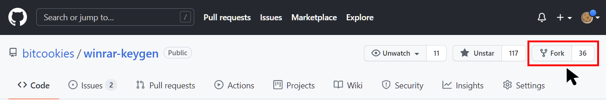
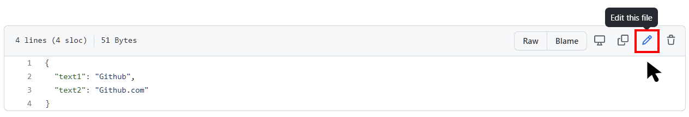
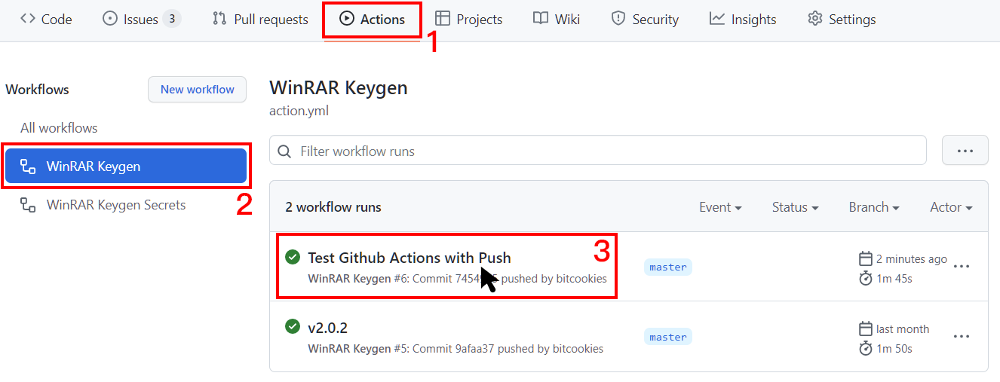
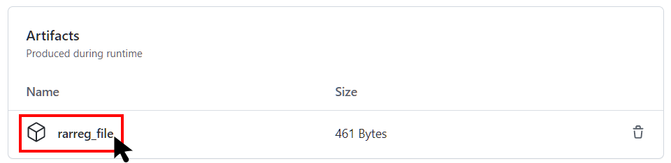

<p align="center">
 
 <h2 align="center">WinRAR Keygen</h2>
 <p align="center">Principle of WinRAR key generation</p>
</p>
<p align="center">
  
  <a href="https://github.com/bitcookies/winrar-keygen/issues">
  	
  </a>
  
  <a href="https://github.com/bitcookies/winrar-keygen/actions">
      
  </a>
  <a href="https://github.com/bitcookies/winrar-keygen/blob/master/LICENSE">
  	
  </a>
</p>


<p align="center">
  <a href="README.zh-CN.md">简体中文</a> | <a href="README.md">English</a>
</p>

## 1. What is WinRAR?

WinRAR is a trialware file archiver utility for Windows, developed by Eugene Roshal of win.rar GmbH. 

It can create and view archives in RAR or ZIP file formats and unpack numerous archive file formats. 

WinRAR is not a free software. If you want to use it, you should pay to [__RARLAB__](https://www.rarlab.com/) and then you will get a license file named `rarreg.key`. 

This repository will tell you how WinRAR license file `"rarreg.key"` is generated. 

## 2. How is "rarreg.key" generated?

See [here](README.HOW_DOES_IT_WORK.md).

## 3. Use Github Actions

Github Action is a CI/CD tool introduced after Microsoft acquired Github, and you can run programs on GitHub Action by following these steps.

### 3.1 Fork

**Fork** this repo.



If you've forked before and I've committed new code, but you don't know how to merge the new content into your repository, then you can delete the current fork and fork again.

### 3.2 Modify info.json

Go to `keygen/info.json` and click on the edit button to edit the file.



You can see：

```json
{
    "text1": "Github",
    "text2": "Github.com"
}
```

You can modify the values corresponding to `text1` and `text2`

```json
{
    "text1": "yourname",
    "text2": "yourteam"
}
```

It is important to note that `test1` and `test2` are **ANSI-encoded string, without null-terminator.**

Once you have finished making changes, click the **Commit changes** button and Github Actions will start automatically.

### 3.3 Download key

Go to the Actions page to see the status of the program.



Green means it ran successfully, yellow means it is running, red means it failed. After running successfully, open the corresponding task and select **rarreg_file** to download.



After decompression, you will get `rarreg.key`, just drag and drop it into WinRAR.

If you get an invalid key, check that the `test1` and `test2 ` parameters are **ANSI encoded without spaces.**

## 4. Build in Visual Studio

I recommend using the Github Actions, but you can still do your own compilation.

If you don't want to compile it yourself, you can also go to the [release](https://github.com/bitcookies/winrar-keygen/releases/) page to get `winrar-keygen.exe`.

### 4.1 Prerequisites

1. Please make sure that you have **Visual Studio 2022**. Because this is a VS2022 project. If you are still using Visual Studio 2019, you can find projects for VS2019 in the [vs2019](https://github.com/bitcookies/winrar-keygen/tree/vs2019) branch, but this branch will no longer be maintained.

2. Please make sure you have installed `vcpkg` and the following libraries: 

   * `mpir:x86-windows-static`
   * `mpir:x64-windows-static`

   is installed.

   You can install them by:

   ```console
   $ vcpkg install mpir:x86-windows-static
   $ vcpkg install mpir:x64-windows-static
   ```

3. Your `vcpkg` has been integrated into your __Visual Studio__, which means you have run successfully.

   ```console
   $ vcpkg integrate install
   ```
   

### 4.2 Build

1. Open this project in __Visual Studio__.

2. Select `Release` configuration.

3. Select __Build > Build Solution__.

You will see executable files in `bin/` directory. 

### 4.3 How to Use?

Execute the following code in the terminal and configure two parameters to generate `rarreg.key`.

Here is an example use `Github` and `Github.com`:

```
Usage:
        winrar-keygen.exe <your name> <license type>

Example:

        winrar-keygen.exe "Github" "Github.com"
  or:
        winrar-keygen.exe "Github" "Github.com" > rarreg.key
```


Now you can see the newly generated file. 

```console
RAR registration data
Github
Github.com
UID=3a3d02329a32b63da7d8
6412212250a7d8753c5e7037d83011171578c57042fa30c506caae
9954e4853d415ec594e46076cc9a65338309b66c50453ba72158c0
656de97acb2f2a48cf3b75329283544c3e1b366a5062b85d0022f6
de3cdc56b311475b484e80b48157a0c3af60ca4f7f9c75d49bc50d
6bad616c1c58caa922d3ed0cd19771e8191522a586544c3e1b366a
5062b85d29db066f02e777ad78100865f2c31f2dd3a86998609b18
5eede7ed46566b10bf033daa6384062b259194b1acbd1443042646
```

Save the generated information as `rarreg.key`.

## 5. Invalid Key

Why is my `rarreg.key` invalid?

### 5.1 ANSI Encoded

`test1` and `test2` are **ANSI-encoded string, without null-terminator.**

```console
winrar-keygen.exe <text1> <text2>
```

### 5.2 Terminal Encode

[Issues #5](https://github.com/bitcookies/winrar-keygen/issues/5) Be sure to use ANSI encoding, without null-terminator.

You can refer to the Microsoft documentation: [Generation of "rarreg.key"](https://github.com/bitcookies/winrar-keygen/blob/master/README.HOW_DOES_IT_WORK.md#7-generation-of-rarregkey)

Thanks [@Sonic-The-Hedgehog-LNK1123](https://github.com/Sonic-The-Hedgehog-LNK1123).

## 6. Encounter problems?

### 6.1 Feedback

If you encounter some problems, you can report on the [Issues](https://github.com/bitcookies/winrar-keygen/issues) page. There will be many enthusiastic developers or Github users to help you.

### 6.2 Security

[Issues #1](https://github.com/bitcookies/winrar-keygen/issues/1) Some Anti-Virus Software may falsely report. If you do not trust this binary executable file, your only option is to compile the code yourself.

### 6.3 Download

[Issues #4](https://github.com/bitcookies/winrar-keygen/issues/4) IDM and other download tools may have problems, please use a browser (e.g. chrome, edge) to download.

## 7. Contributing

This project welcomes contributions and suggestions. You can make suggestions in [Issues](https://github.com/bitcookies/winrar-keygen/issues), or submit a pull request :-)

Thank you very much to some enthusiastic developers for helping answer some questions in [Issues](https://github.com/bitcookies/winrar-keygen/issues).

Thanks [@Sonic-The-Hedgehog-LNK1123](https://github.com/Sonic-The-Hedgehog-LNK1123) and [@nitu2003](https://github.com/nitu2003)

## 8. License

The code is available under the [MIT license](https://github.com/bitcookies/winrar-keygen/blob/master/LICENSE)
