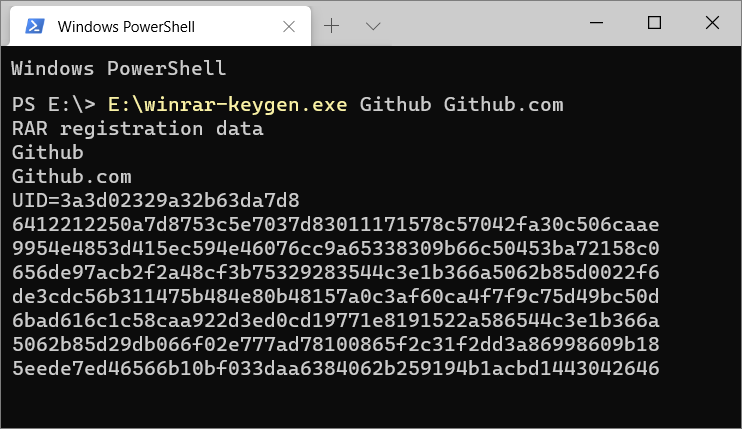

<p align="center">
 
 <h2 align="center">WinRAR Keygen</h2>
 <p align="center">Principle of WinRAR key generation</p>
</p>
<p align="center">
  <a href="https://github.com/bitcookies/winrar-keygen/releases"></a>
  <a href="https://github.com/bitcookies/winrar-keygen/issues"></a>
  
  <a href="https://github.com/bitcookies/winrar-keygen/actions"></a>
  <a href="https://github.com/bitcookies/winrar-keygen/blob/master/LICENSE"></a>
</p>
<p align="center">
   <a href="README.md">English</a> | <a href="README.zh-CN.md">简体中文</a>
</p>

## 1. What is WinRAR?

WinRAR is a trialware file archiver utility for Windows, developed by Eugene Roshal of win.rar GmbH. 

It can create and view archives in RAR or ZIP file formats and unpack numerous archive file formats. 

WinRAR is not a free software. If you want to use it, you should pay to [**RARLAB**](https://www.rarlab.com/) and then you will get a license file named `rarreg.key`. 

This repository will tell you how WinRAR license file `"rarreg.key"` is generated. 

## 2. How is "rarreg.key" generated?

See [here](README.HOW_DOES_IT_WORK.md).

## 3. How to use?

There are several ways to use it.

- [Use Github Actions](#4-Use-Github-Actions) 
- [Use Github Actions with secrets](#5-Use-Github-Actions-with-secrets)
- [Build in Visual Studio](#6-Build-in-Visual-Studio)

### 3.1 Encoding

WinRAR Keygen supports `ASCII`, `ANSI` and `UTF8NoBOM` encoding types, the corresponding supported characters are listed in the table below.

> [!NOTE]
> The default is `utf8`, but you can specify the encoding as `ascii` or `ansi`.

| Encoding                                     | Supported Characters                                         | Character Examples                                           |
| -------------------------------------------- | ------------------------------------------------------------ | ------------------------------------------------------------ |
| [ascii](https://en.wikipedia.org/wiki/ASCII) | Only full ASCII characters are supported.                    |  |
| ansi                                         | There is no one fixed ANSI code, usually [Windows-1252](https://en.wikipedia.org/wiki/Windows-1252), but other local codes are also possible. |  |
| [utf8](https://en.wikipedia.org/wiki/UTF-8)  | Supports UTF-8 without BOM.                                  | ASCII characters, English, 简体中文, 繁體中文, Deutsch, Français, Русский, Italiano, 日本語, 한국어, Lengua española, Ελληνική γλώσσα, et al. |

### 3.2 License type

There are two types of WinRAR licenses, `rarreg.key` and `rarkey.rar`, which differ only in their import.

|                   rarreg.key                   |                    rarkey.rar                    |
| :--------------------------------------------: | :----------------------------------------------: |
|  |  |
|     Drag to import or place in a location      |       Double-click to run automatic import       |

You can try to put the `rarreg.key` in the following directory.

```shell
%APPDATA%\WinRAR\rarreg.key
```

You can also compress `rarreg.key` into `rarkey.rar` and double-click it to run it, and the license import will take place automatically.

## 4. Use Github Actions

<details>
<summary>Click to expand</summary>

The new workflow can easily help you generate a license, you just need to follow these steps.

> Your `Username` and `License Name` will appear in the actions log, if you don't want to give out this information, see [5. Using Github Actions with secrets](#5-Use-Github-Actions-with-secrets).

### 4.1 Fork

**Fork** this repo.


### 4.2 Allow fork repo to run workflows

Go back to the repo you just forked and click **Actions** to allow Workflows to run in your forked repo.


### 4.3 Run workflow

After allowing the workflow, go to **Actions > WinRAR Keygen > Run workflow** and fill in the information to start generating.

> For the difference of license encoding, please refer to [3.1 Encoding](#31-Encoding).


After running successfully, open the corresponding task and select **rarreg_file** to download.

> File retention 90 days.


Extract rarreg_file.zip to get `rarreg.key` and drag to import into WinRAR. You can also compress `rarreg.key` into `rarkey.rar`, then double-click it to run it, and the license import will be done automatically.

</details>

## 5. Use Github Actions with secrets

<details>
<summary>Click to expand</summary>

Using [secrets](https://docs.github.com/en/actions/security-guides/encrypted-secrets) can help you hide license information.

### 5.1 Fork

**Fork** this repo.


### 5.2 Allow fork repo to run workflows

Go back to the repo you just forked and click **Actions** to allow Workflows to run in your forked repo.


### 5.3 Create secrets

After allowing the workflow, go to **Settings > Secrets and variables > Actions > New repository secret** to create a secret.


Create three secrets with the names `TEXT1`, `TEXT2` and `PWD` and fill in the relevant values.

> The value filled in should be consistent with the type of code you have chosen.

| Secrets Name | Explanation |
| ------------------------------- | ------------------------------ |
| TEXT1                           | Your Name                      |
| TEXT2                           | Your License Name              |
| PWD                             | 7-Zip Password                 |


Once created, you will see it.


### 5.4 Run workflow

Go to **Actions** and select **WinRAR Keygen with secrets** to run workflow manually.

For the difference of license encoding, please refer to [3.1 Encoding](#31-Encoding).


After running successfully, open the corresponding task and select **rarreg_file** to download.

> File retained for **1 day** only.


Extract `rarreg_file.zip` to get `rarreg.7z`, unzip it with the password to get `rarreg.key`, then drag and drop to import into WinRAR. You can also compress `rarreg.key` into `rarkey.rar`, then double-click it to run it, and the license import will be done automatically.

</details>

## 6. Build in Visual Studio

<details>
<summary>Click to expand</summary>

I recommend using the Github Actions, but you can still do your own compilation.

If you don't want to compile it yourself, you can also go to the [release](https://github.com/bitcookies/winrar-keygen/releases/) page to get `winrar-keygen.exe`.

### 6.1 Prerequisites

1. Please make sure that you have **Visual Studio 2022**. Because this is a VS2022 project. If you are still using Visual Studio 2019, you can find projects for VS2019 in the [vs2019](https://github.com/bitcookies/winrar-keygen/tree/vs2019) branch, but this branch will no longer be maintained.

2. Please make sure you have installed `vcpkg` and the following libraries:

   + `mpir:x86-windows-static`
   + `mpir:x64-windows-static`
   + `mpir:gmp:x64-windows`

   is installed.

   You can install them by:

   ```shell
   $ vcpkg install mpir:x86-windows-static
   $ vcpkg install mpir:x64-windows-static
   $ vcpkg install gmp:x64-windows
   ```

3. Your `vcpkg` has been integrated into your **Visual Studio**, which means you have run successfully.

   ```shell
   $ vcpkg integrate install
   ```
   

### 6.2 Build

1. Open this project in **Visual Studio**.

2. Select **Release** configuration.

3. Select **Build > Build Solution**.

You will see executable files in `bin/` directory. 

### 6.3 How to use?

Execute the following code in the terminal and configure two parameters to generate `rarreg.key`.

```shell
Usage:
  winrar-keygen.exe <Username> <LicenseName> [options]
  winrar-keygen.exe -v | --version
  winrar-keygen.exe -h | --help

Options:
  -e, --encoding <enc>   utf8 (default), ascii, ansi
  -o, --output <file>    Output file (default: rarreg.key)
  -a, --activate         Write to %%APPDATA%%\WinRAR\rarreg.key
  -t, --text             Print to console only, don't write file
  -v, --version          Show version
  -h, --help             Show this help
```

#### Options

| Flag                   | Description                              |
| :--------------------- | :--------------------------------------- |
| `-e, --encoding <enc>` | `ascii`, `ansi`, `utf8` (default)        |
| `-o, --output <file>`  | Output file path (default: `rarreg.key`) |
| `-a, --activate`       | Write to `%APPDATA%\WinRAR\rarreg.key`   |
| `-t, --text`           | Print to console only, don't write file  |
| `-v, --version`        | Show version                             |
| `-h, --help`           | Show help                                |

Here is an example of ASCII encoding for `Github` and `Single PC usage license`.

```shell
./winrar-keygen.exe "Github" "Single PC usage license" -t -e ascii
```



Now you can see the newly generated file.

```console
RAR registration data
Github
Single PC usage license
UID=3a3d02329a32b63da7d8
6412212250a7d8753c5e7037d83011171578c57042fa30c506caae
9954e4853d415ec594e46017cb3db740bc4b32e47aea25db62f350
9f22065a27da4f8216d2938e1050b6e3347501a3767d1fdd7ee130
dd4ab952600ba16a99236d910bfa995d5f60651ec451f462511507
95b3722d059f2d5303a231e396cf21f17098edeec0b6e3347501a3
767d1fdd7ee45388769767642338ee8a63178f3458b71de5609b18
5eede7ed46566b10bf033daa6384062b259194b1acbd0378116064
```

### 6.4 More examples

Generate a UTF-8 encoded license and activate WinRAR directly.

> The UTF-8 encoded license will automatically determine whether to add the `utf8:` prefix based on the characters.

```shell
./winrar-keygen.exe "Github" "Single PC usage license" -a
```

Generate an ANSI-encoded license and generate a license file.

> ANSI encoding is region-dependent on Windows. While characters in the current region may display correctly, garbled characters may still occur.

```shell
./winrar-keygen.exe "Github" "Single PC usage license" -e ansi
```

Generate an ASCII-encoded license and output it only to the console.

```shell
./winrar-keygen.exe "Github" "Single PC usage license" -t -e asci
```

</details>

## 7. Common Errors

### 7.1 Keygen Errors

Starting with version `ver4`, Keygen has added some common error messages. Please make corrections based on the output.

 Use `-h` or `--help` to view the help information:

```shell
./winrar-keygen.exe -h
```

### 7.2 Github Actions Errors

If you encounter an error while using `ascii` encoding, it is because you are using non-ASCII characters.

If you encounter an error while using `ansi` encoding, it is because the character encoding is not supported by the current Windows system. The system platform for GitHub Actions is `windows-2022-english` (ANSI code page 1252), and any non-ASCII characters will cause the process to fail.


## 8. Contributing

### 8.1 Suggestion

If you encounter any issues or have suggestions, feel free to open an issue on the [Issues](https://github.com/bitcookies/winrar-keygen/issues) page or submit a pull request. We and the community will be happy to help.

### 8.2 Thanks

Thanks to all contributors to this project, and to the community members who help answer questions in the [Issues](https://github.com/bitcookies/winrar-keygen/issues).

## 9. License

The code is available under the [MIT license](https://github.com/bitcookies/winrar-keygen/blob/master/LICENSE)
