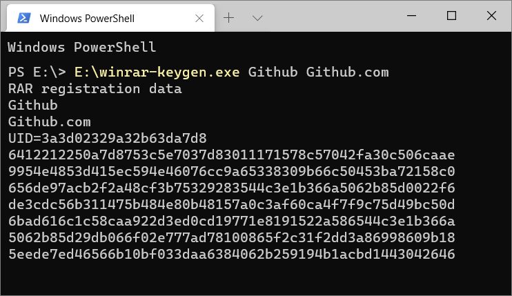

<p align="center">
 
 <h2 align="center">WinRAR Keygen</h2>
 <p align="center">Principle of WinRAR key generation</p>
</p>
<p align="center">
  <a href="https://github.com/bitcookies/winrar-keygen/releases"></a>
  <a href="https://github.com/bitcookies/winrar-keygen/issues"></a>
  
  <a href="https://github.com/bitcookies/winrar-keygen/actions"></a>
  <a href="https://github.com/bitcookies/winrar-keygen/blob/master/LICENSE"></a>
</p>
<p align="center">
  <a href="README.zh-CN.md">简体中文</a> | <a href="README.md">English</a>
</p>


## 1. WinRAR是什么？

WinRAR 是一款用于管理压缩包文件的共享软件。其算法由作者尤金·罗谢尔研发，享有原创专利。

它可以用来创建或浏览 RAR、ZIP 等众多格式的压缩包。

WinRAR 不是免费软件。如果你想使用它，你应当向 [__RARLAB__](https://www.rarlab.com/) 付费，然后获得一个授权文件 `rarreg.key`。

这份 repo 将会告诉你 `rarreg.key` 是如何生成的。

## 2. "rarreg.key"是如何生成的？

见 [这里](README.HOW_DOES_IT_WORK.zh-CN.md)。

## 3. 使用方法

有多种方法可供选择：

+ [使用 Github Actions](#4-使用-Github-Actions)
+ [使用 Github Actions with secrets](#5-使用-Github-Actions-with-secrets)
+ [通过 Visual Studio 编译使用](#6-通过-Visual-Studio-编译使用)

### 3.1 编码说明

WinRAR Keygen 支持 `ASCII`、`ANSI` 和 `UTF-8` 三种编码类型，对应支持的字符如下表：

> [!NOTE]
> 默认使用 `utf8`，但是你也可以指定编码为 `ascii` 或 `ansi`。

| 编码                                         | 支持的字符                                                   | 字符示例                                                     |
| -------------------------------------------- | ------------------------------------------------------------ | ------------------------------------------------------------ |
| [ascii](https://en.wikipedia.org/wiki/ASCII) | 仅支持 ASCII 编码字符                                        |  |
| ansi                                         | 没有一种固定的 ANSI 编码，通常是 [Windows-1252](http://en.wikipedia.org/wiki/Windows-1252)，但也可以是其他本地 |  |
| [utf8](https://en.wikipedia.org/wiki/UTF-8)  | 支持 UTF-8 编码字符                                          | ASCII characters, English, 简体中文, 繁體中文, Deutsch, Français, Русский, Italiano, 日本語, 한국어, Lengua española, Ελληνική γλώσσα 等。 |

### 3.2 License 类型

WinRAR license 有 `rarreg.key` 和 `rarkey.rar` 两种类型，它们仅在导入上有区别：

| rarreg.key |  rarkey.rar  |
| :--------------------------------------------: | :----------------------------------------------: |
|  |  |
|             拖动导入或放于指定位置             |                 双击运行自动导入                 |

如果你无法执行拖动操作，你可以尝试把 `rarreg.key` 放置于以下目录中：

```shell
C:\Users\yourname\AppData\Roaming\WinRAR\rarreg.key
```

你也可以将 `rarreg.key` 压缩成 `rarkey.rar` 然后双击运行，授权导入将会自动进行。

## 4. 使用 Github Actions

<details>
<summary>点击展开</summary>

新的 workflow 能很方便的帮助你生成 license，你只需跟随以下步骤即可：

> 你的 `Username` 和 `License Name` 会出现在 actions 的日志中，如果你不想泄露这些信息，请参考 [5. 使用 Github Actions with secrets](#5-使用-Github-Actions-with-secrets)。

### 4.1 Fork

点击该项目右上角的 **Fork** 按钮，fork 一份代码到你的 Github：


### 4.2 允许 fork 仓库运行 workflows

返回到你刚刚 fork 完成的 repo，然后点击 **Actions** 去允许 workflows 在你的 fork repo 中运行：


### 4.3 运行 workflow

允许 workflow 后，选择 **WinRAR Keygen > Run workflow** 并填入信息就可以开始生成了：

> License 编码的区别请参考 [3.1 编码说明](#31-编码说明)。


运行成功之后，打开对应的任务，选择 **rarreg_file** 下载：

> 文件保留 90 天，超出时间后会自动销毁。


将 `rarreg_file.zip` 解压缩后会得到 `rarreg.key`，然后拖动导入 WinRAR 即可。你也可以将 `rarreg.key` 压缩成 `rarkey.rar`，然后双击运行，授权导入将会自动进行。

如果你得到的是 key 是无效的，请查看[解决方法](#7-无效的-Key)。

</details>

## 5. 使用 Github Actions with secrets

<details>
<summary>点击展开</summary>

使用 [secrets](https://docs.github.com/en/actions/security-guides/encrypted-secrets) 可以帮助你隐藏 license 信息。

### 5.1 Fork

点击该项目右上角的 **Fork** 按钮，fork 一份代码到你的 Github：


### 5.2 允许 fork 仓库运行 workflows

返回到你刚刚 fork 完成的 repo，然后点击 **Actions** 去允许 workflows 在你的 fork repo 中运行：


### 5.3 创建 secrets

允许 workflows 后，进入 **Settings > Secrets and variables > Actions > New repository secret** 来创建 secrets：


创建三个 secrets，名称为 `TEXT1` 、 `TEXT2` 和 `PWD`，并填入相关值：

> 填入的值应与你选择的编码类型保持一致。

| Secrets Name | Explanation |
| ------------------------------- | ------------------------------ |
| TEXT1                           | 用户名                         |
| TEXT2                           | 许可名                         |
| PWD                             | 压缩包密码                     |


创建完成后，你将会看到：


### 5.4 运行 workflow

进入 **Actions** 选择 **WinRAR Keygen with secrets  >  Run workflow** 并填入信息：

> License 编码的区别请参考 [3.1 编码说明](#31-编码说明)。


运行成功之后，打开对应的任务，选择 **rarreg_file** 下载：

> 文件仅保留 **1 天**，请及时下载。


将 `rarreg_file.zip` 解压缩后会得到 `rarreg.7z`，使用你设置的密码进行解压缩获得 `rarreg.key`，然后拖动导入 WinRAR 即可。你也可以将 `rarreg.key` 压缩成 `rarkey.rar`，然后双击运行，授权导入将会自动进行。

如果你得到的是 key 是无效的，请查看[解决方法](#7-无效的-Key)。

</details>

## 6. 通过 Visual Studio 编译使用

<details>
<summary>点击展开</summary>

我建议通过 Github Actions 的方法来使用，但是你仍然可以选择自行编译。

如果你不想自行编译，也可以到 [Release](https://github.com/bitcookies/winrar-keygen/releases/) 页面获取对应版本的 `winrar-keygen.exe`。

### 6.1 前提条件

1. 请确保你有 **Visual Studio 2022**，因为这是一个 VS2022 项目。如果你仍在使用 Visual Studio 2019，可以在 [vs2019](https://github.com/bitcookies/winrar-keygen/tree/vs2019) 分支中找到适合 VS2019 的项目，但是此分支将不再维护。

2. 请确保你安装了 `vcpkg` 以及下面几个库：

   - `mpir:x86-windows-static`

   * `mpir:x64-windows-static`

   你可以通过下的命令来安装：

   ```shell
   $ vcpkg install mpir:x86-windows-static
   $ vcpkg install mpir:x64-windows-static
   ```

3. 你的 `vcpkg` 与 __Visual Studio__ 整合了，即你曾成功运行了下面这条命令：

   ```shell
   $ vcpkg integrate install
   ```

### 6.2 编译

1. 在 __Visual Studio__ 中打开这个项目；
2. 选择 `Release` 配置；
3. 选择 __生成 > 生成解决方案__。

你将在 `bin/` 目录下看到生成的文件。

### 6.3 如何使用？

直接在终端执行以下代码，配置两个参数即可生成 `rarreg.key`。

这里以 `Github` 和 `Single PC usage license` 用 ASCII 编码为例：

```shell
Usage:
        winrar-keygen.exe <Username> <License Name>

Example:

        winrar-keygen.exe "Github" "Single PC usage license"

  or:
        winrar-keygen.exe "Github" "Github.com" | Out-File -Encoding ASCII rarreg.key
```



现在你可以看到新生成的文件：

```console
RAR registration data
Github
Single PC usage license
UID=3a3d02329a32b63da7d8
6412212250a7d8753c5e7037d83011171578c57042fa30c506caae
9954e4853d415ec594e46017cb3db740bc4b32e47aea25db62f350
9f22065a27da4f8216d2938e1050b6e3347501a3767d1fdd7ee130
dd4ab952600ba16a99236d910bfa995d5f60651ec451f462511507
95b3722d059f2d5303a231e396cf21f17098edeec0b6e3347501a3
767d1fdd7ee45388769767642338ee8a63178f3458b71de5609b18
5eede7ed46566b10bf033daa6384062b259194b1acbd0378116064
```

将生成的信息以 **ANSI 编码** 的文本格式保存为 `rarreg.key`。

### 6.4 多语言的支持

使用 ANSI 编码时，你只能使用你操作系统所在国家或地区的字符。ANSI 编码从 Powershell 7.4 以后开始支持，你还需要[升级你的 Powershell](https://learn.microsoft.com/en-us/powershell/scripting/install/installing-powershell-on-windows?view=powershell-7.4)。

用 ANSI 编码生成多语言的 license：

```shell
winrar-keygen.exe "简体中文" "license" | Out-File -Encoding ansi rarreg.key

winrar-keygen.exe "繁體中文" "license" | Out-File -Encoding ansi rarreg.key

winrar-keygen.exe "Deutsch" "license" | Out-File -Encoding ansi rarreg.key

winrar-keygen.exe "Français" "license" | Out-File -Encoding ansi rarreg.key

winrar-keygen.exe "日本語" "license" | Out-File -Encoding ansi rarreg.key

winrar-keygen.exe "한국어" "license" | Out-File -Encoding ansi rarreg.key
```

使用 UTF-8 编码生成多语言的 license 时，你可能需要在 “控制面板 > 时钟和区域 > 区域 > 管理 > 更改系统区域设置” 中勾选使用 “[Beta版:使用Unicode UTF-8提供全球语言支持](https://stackoverflow.com/a/57134096/10242225)” 才能正确的处理数据。但是不建议你这么操作，这可能会导致很多软件无法正常运行，建议[使用 Github Actions](#4-使用-Github-Actions)。

用 UTF-8 编码生成多语言的 license：

> `utf8:` 是为了保证在不同语言的 WinRAR 中做到不变的字符表示。

```shell
winrar-keygen.exe "utf8:简体中文" "license" | Out-File -Encoding utf8 rarreg.key

winrar-keygen.exe "utf8:繁體中文" "license" | Out-File -Encoding utf8 rarreg.key

winrar-keygen.exe "utf8:Deutsch" "license" | Out-File -Encoding utf8 rarreg.key

winrar-keygen.exe "utf8:Français" "license" | Out-File -Encoding utf8 rarreg.key

winrar-keygen.exe "utf8:日本語" "license" | Out-File -Encoding utf8 rarreg.key

winrar-keygen.exe "utf8:한국어" "license" | Out-File -Encoding utf8 rarreg.key
```

</details>

## 7. 无效的 Key

为什么我生成的 `rarreg.key` 是无效的？

### 7.1 字符编码不正确

参数 `TEXT1` 和 `TEXT2` 需要满足[对应的编码要求](#31-编码说明)：

```console
winrar-keygen.exe <TEXT1> <TEXT2>
```

具体可参考原理文档：[授权文件"rarreg.key"的生成](https://github.com/bitcookies/winrar-keygen/blob/master/README.HOW_DOES_IT_WORK.zh-CN.md#7-%E6%8E%88%E6%9D%83%E6%96%87%E4%BB%B6rarregkey%E7%9A%84%E7%94%9F%E6%88%90)

### 7.2 文本储存编码不正确

如果你使用了如下命令：

```shell
winrar-keygen.exe "Github" "Single PC usage license" > rarreg.key
```

在较新的 Windows 10 系统中，PowerShell 将默认以 **UTF16-LE** 格式导出，这将会导致错误。

请指定输出编码格式，例如：

```shell
winrar-keygen.exe "Github" "Github.com" | Out-File -Encoding ascii rarreg.key

winrar-keygen.exe "Github" "Github.com" | Out-File -Encoding ansi rarreg.key

winrar-keygen.exe "utf8:Github" "Github.com" | Out-File -Encoding utf8 rarreg.key
```

### 7.3 关于简体中文版

在 [__RARLAB__](https://www.rarlab.com/) 下载的简体中文版 WinRAR 将会自带广告组件，即使使用了 `rarreg.key` 授权，广告组件依旧会出现。这是由于简体中文代理商的一些意见，RARLAB 已将简体中文安装包的公开链接更换成了带有广告的简体中文安装包。

感谢 [@hoochanlon](https://github.com/hoochanlon) 提供的一些方法。可以使用 [win-rar-extractor](https://github.com/lvtx/WinRAR-Extractor) 获取简体中文商业版的下载连接；也可以根据商业版的地址规律，获取相应版本的简体中文安装包：

简体中文**商业版**（以 6.24 和 7.01 版本为例）：

```
6.24
https://www.win-rar.com/fileadmin/winrar-versions/sc/sc20231013/wrr/winrar-x32-624sc.exe
https://www.win-rar.com/fileadmin/winrar-versions/sc/sc20231013/wrr/winrar-x64-624sc.exe

7.01
https://www.win-rar.com/fileadmin/winrar-versions/sc/sc20240528/wrr/winrar-x32-701sc.exe
https://www.win-rar.com/fileadmin/winrar-versions/sc/sc20240528/wrr/winrar-x64-701sc.exe
```

简体中文**广告版**（以 6.24 版本为例）：

```
win-rar 渠道：
https://www.win-rar.com/fileadmin/winrar-versions/winrar/winrar-x32-624sc.exe
https://www.win-rar.com/fileadmin/winrar-versions/winrar/winrar-x64-624sc.exe

rarlab 渠道：
https://www.rarlab.com/rar/winrar-x32-624sc.exe
https://www.rarlab.com/rar/winrar-x64-624sc.exe
```

请注意区分上述连接地址，更多方法可以查看 [Issues #14](https://github.com/bitcookies/winrar-keygen/issues/14) 和 [Issues #19](https://github.com/bitcookies/winrar-keygen/issues/19)。

## 8. 贡献

### 8.1 反馈和建议

如果您遇到了一些问题，可在 [Issues](https://github.com/bitcookies/winrar-keygen/issues) 页面反馈，会有很多热心的开发者及 Github 用户帮助你。

该项目欢迎贡献和建议，您可以在 [Issues](https://github.com/bitcookies/winrar-keygen/issues) 提出建议，或者进行提交拉取请求 😄

### 8.2 感谢

非常感谢一些热心的开发者，在 [Issues](https://github.com/bitcookies/winrar-keygen/issues) 帮助解答一些问题。

🏆 特别感谢 [@Sonic-The-Hedgehog-LNK1123](https://github.com/Sonic-The-Hedgehog-LNK1123)

## 9. 许可

使用 [MIT License](https://github.com/bitcookies/winrar-keygen/blob/master/LICENSE)
